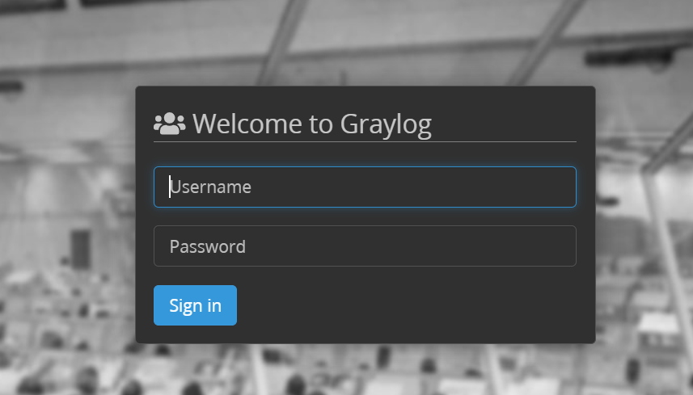
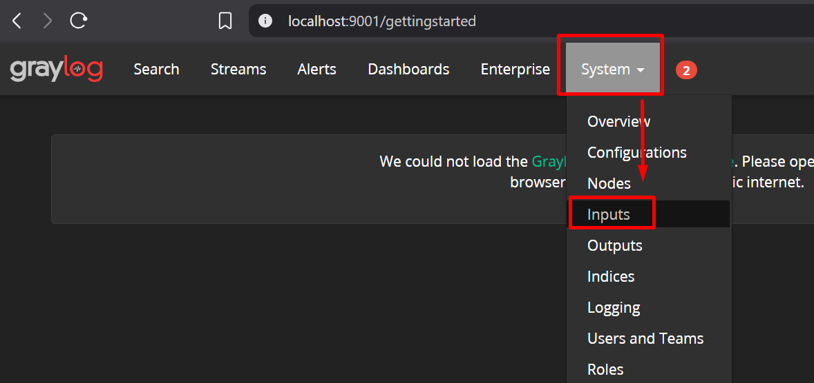
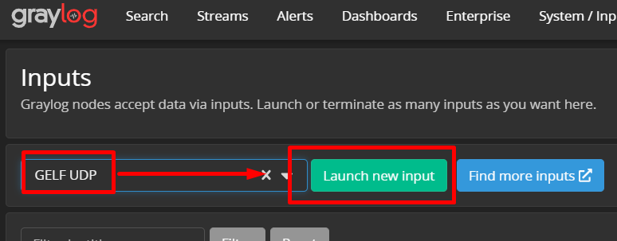
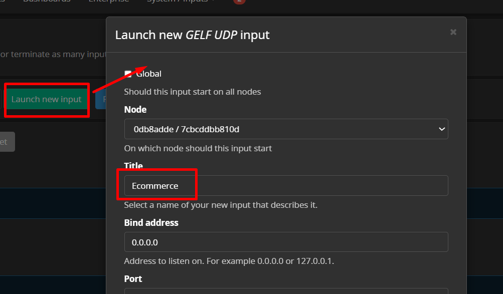
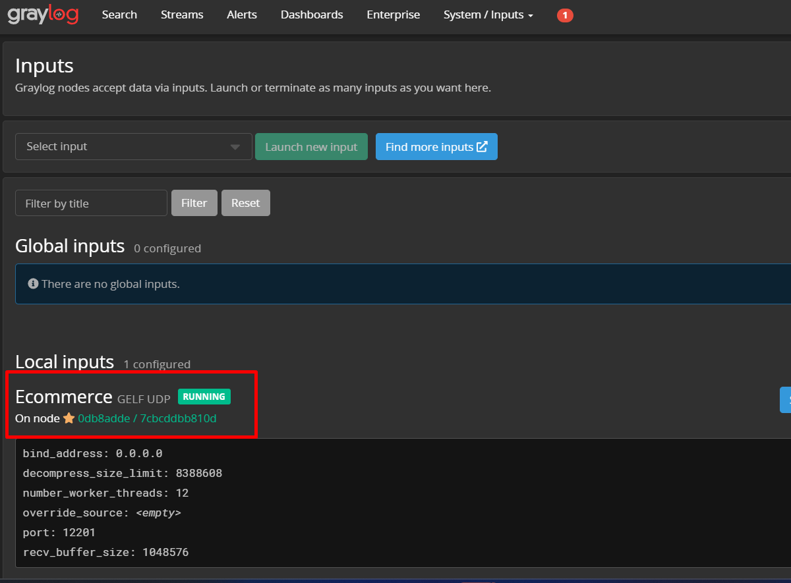
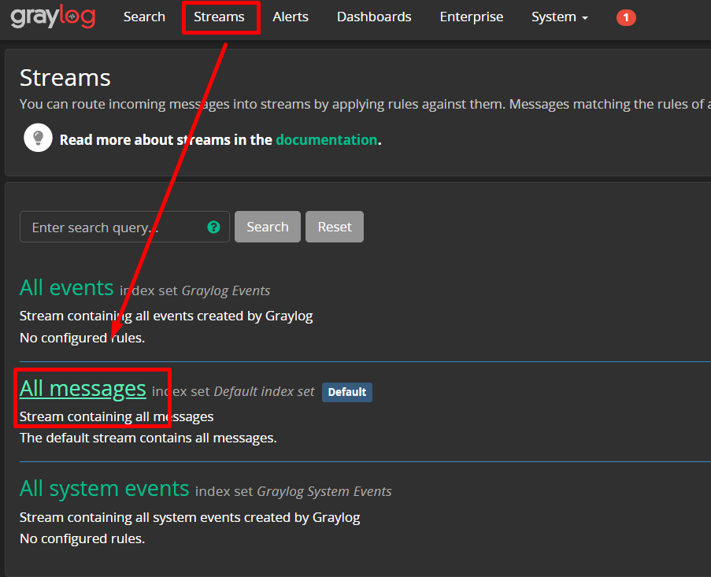
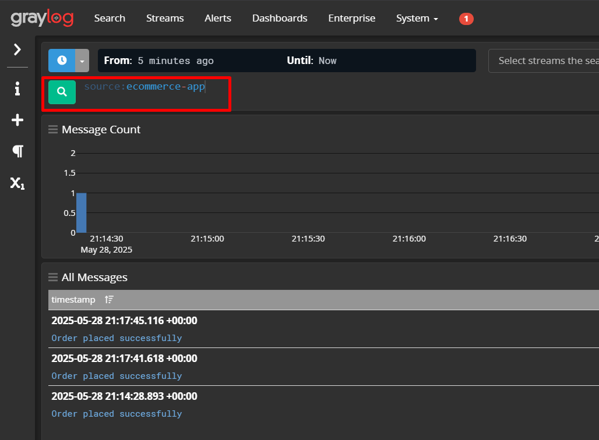
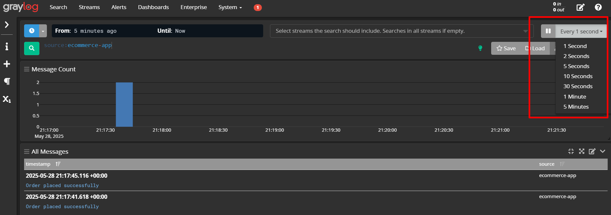

# 📚 Tutorial Graylog: Configurar Input "Ecommerce" y Streams

## 🎯 Objetivo
Este tutorial te enseñará cómo configurar un input personalizado llamado "Ecommerce" en Graylog y cómo visualizar los mensajes en streams. Ideal para centralizar logs de aplicaciones de comercio electrónico.

---

## 📋 Prerequisitos

✅ Graylog ejecutándose en http://localhost:9001  
✅ Credenciales: `admin` / `admin`  
✅ Docker compose funcionando correctamente  

---

## 🚀 Paso 1: Acceder a Graylog

1. **Abrir navegador** y ir a: `http://localhost:9001`

2. **Iniciar sesión** con:
   - **Usuario:** `admin`
   - **Contraseña:** `admin`



3. **Verificar acceso** - deberías ver el dashboard principal de Graylog

---

## ⚙️ Paso 2: Crear Input "Ecommerce"

### 2.1 Navegar a System/Inputs

1. En el menú superior, hacer clic en **"System"**
2. En el menú lateral izquierdo, seleccionar **"Inputs"**
3. Te aparecerá la página de gestión de inputs



### 2.2 Seleccionar tipo de Input

1. En la sección **"Select input"**, buscar el dropdown
2. Seleccionar **"GELF UDP"** (recomendado para logs de aplicaciones)
   - **¿Por qué GELF UDP?** Es el formato nativo de Graylog, eficiente y con estructura JSON
3. Hacer clic en **"Launch new input"**



### 2.3 Configurar el Input

Se abrirá un modal de configuración. Completar los siguientes campos:

#### **Configuración Básica:**
- **Title:** `Ecommerce`


### 2.4 Guardar Input

1. Hacer clic en **"Save"** o **"Launch Input"**
2. Verificar que aparezca en la lista de inputs con estado **"RUNNING"**
3. Deberías ver: `Ecommerce (GELF UDP) - RUNNING`


---

## 📡 Paso 3: Enviar Log de Prueba

Para verificar que el input funciona, puedes enviar un log de prueba:

### Opción A: Usar Python (si tienes Python instalado)
```python
import json
import socket
import gzip
from datetime import datetime

# Mensaje de ejemplo de ecommerce
log_data = {
    "version": "1.1",
    "host": "ecommerce-app",
    "short_message": "Order placed successfully",
    "full_message": "Customer John Doe placed order #12345 for $299.99",
    "timestamp": datetime.now().timestamp(),
    "level": 6,
    "facility": "ecommerce",
    "_order_id": "12345",
    "_customer_name": "John Doe",
    "_amount": 299.99,
    "_payment_method": "credit_card"
}

# Enviar a Graylog
sock = socket.socket(socket.AF_INET, socket.SOCK_DGRAM)
data = json.dumps(log_data).encode('utf-8')
compressed_data = gzip.compress(data)
sock.sendto(compressed_data, ('localhost', 12201))
sock.close()
print("Log enviado a Graylog!")
```

### Opción B: Usar curl (Linux/Mac/Windows con curl)
```bash
echo '{"version":"1.1","host":"ecommerce-app","short_message":"Test order","full_message":"Test order placed","timestamp":1640995200,"level":6,"_order_id":"TEST123"}' | gzip | nc -u localhost 12201
```

### Opción C: Configurar tu aplicación
En tu aplicación real, configura el logger para enviar a `localhost:12201` usando GELF format.

---

## 📊 Paso 4: Ver Streams - "All Messages"

### 4.1 Acceder a Streams

1. En el menú superior, hacer clic en **"Streams"**
2. Deberías ver la lista de streams disponibles

### 4.2 Ver "All Messages"

1. Buscar el stream llamado **"All messages"**
2. Hacer clic en **"All messages"**
3. Te llevará a la vista de búsqueda con todos los mensajes



### 4.3 Configurar la Vista

#### **Filtrar por Input:**
1. En la barra de búsqueda, puedes filtrar por tu input:
   ```
   gl2_source_input:YOUR_INPUT_ID
   ```
   O más fácil:
   ```
   source:ecommerce-app
   ```


#### **Ajustar Tiempo:**
1. En la parte superior derecha, ajustar el rango de tiempo
2. Seleccionar **"Every 5 seconds"** o **"1 minute"**




---

## 🔍 Paso 5: Verificar que Todo Funciona

### 5.1 Checklist de Verificación

- [ ] Input "Ecommerce" aparece como **RUNNING**
- [ ] Se pueden ver mensajes en "All messages"
- [ ] Los logs aparecen con la fuente correcta

### 5.2 Si No Ves Mensajes

1. **Verificar Input:**
   - Ve a `System > Inputs`
   - Confirma que el input esté "RUNNING"
   - Revisa el puerto (debe ser 12201)

2. **Verificar Logs del Contenedor:**
   ```bash
   docker logs -f graylog
   ```

3. **Verificar Conectividad:**
   ```bash
   # Verificar que el puerto esté abierto
   netstat -tulpn | grep 12201
   
   # O en Windows
   netstat -an | findstr 12201
   ```

4. **Revisar Firewall:**
   - Asegúrate de que el puerto 12201 no esté bloqueado

---

## 📈 Paso 6: Configuraciones Adicionales (Opcional)

### 6.1 Crear Stream Específico para Ecommerce

1. Ve a **"Streams"**
2. Clic en **"Create Stream"**
3. Configurar:
   - **Title:** `Ecommerce Orders`
   - **Description:** `Stream for ecommerce order logs`
4. Crear reglas de stream:
   - **Field:** `source`
   - **Type:** `match exactly`
   - **Value:** `ecommerce-app`

### 6.2 Configurar Alertas

1. En el stream de Ecommerce, ir a **"Manage Alerts"**
2. Crear alertas para:
   - Errores de pago
   - Pedidos fallidos
   - Volumen anormal de pedidos

### 6.3 Crear Dashboard

1. Ve a **"Dashboards"**
2. Crear dashboard con widgets para:
   - Pedidos por hora
   - Métodos de pago más usados
   - Errores más comunes

---

## 🛠️ Comandos Útiles de Búsqueda

### Búsquedas Básicas:
```
# Todos los logs de ecommerce
source:ecommerce-app

# Solo errores
level:3

# Pedidos específicos
_order_id:12345

# Logs de las últimas 2 horas
timestamp:[now-2h TO now]

# Combinadas
source:ecommerce-app AND level:6 AND _order_id:*
```

### Búsquedas Avanzadas:
```
# Pedidos con monto alto
_amount:>1000

# Errores de pago
message:"payment failed" OR message:"card declined"

# Clientes específicos
_customer_name:"John Doe"

# Rango de fechas específico
timestamp:[2024-01-01 TO 2024-01-31]
```

---

## ✅ Resumen

Has aprendido a:

1. ✅ **Crear un Input** llamado "Ecommerce" usando GELF UDP
2. ✅ **Configurar el Input** en el puerto 12201
3. ✅ **Enviar logs de prueba** para verificar funcionamiento
4. ✅ **Navegar a Streams** y ver "All messages"
5. ✅ **Filtrar y buscar** logs específicos

---

## 🚀 Próximos Pasos

- Integra tu aplicación real con Graylog
- Crea dashboards personalizados
- Configura alertas para eventos críticos
- Explora extractors para parsear logs complejos
- Aprende sobre pipelines para procesamiento avanzado

