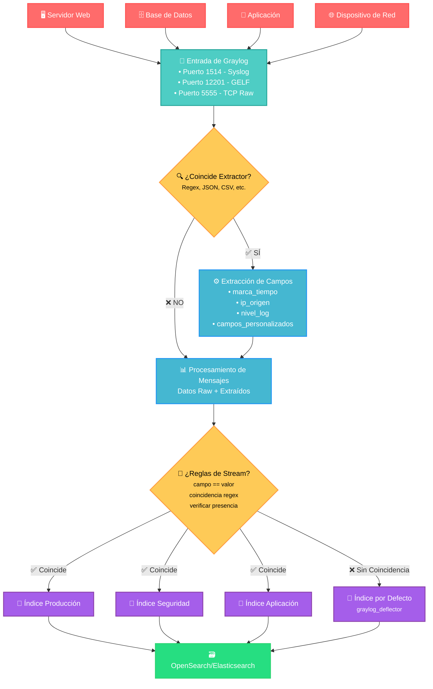

## Flujo de Procesamiento de Graylog

docker exec -it graylog bash

```mermaid
flowchart TD
    %% Capa de Entrada
    A1[🖥️ Servidor Web] --> B
    A2[🗄️ Base de Datos] --> B
    A3[🔧 Aplicación] --> B
    A4[🌐 Dispositivo de Red] --> B
    
    B[🚪 Entrada de Graylog<br/>• Puerto 1514 - Syslog<br/>• Puerto 12201 - GELF<br/>• Puerto 5555 - TCP Raw]
    
    %% Capa de Procesamiento
    B --> C{🔍 ¿Coincide Extractor?<br/><small>Regex, JSON, CSV, etc.</small>}
    
    C -->|✅ SÍ| D[⚙️ Extracción de Campos<br/>• marca_tiempo<br/>• ip_origen<br/>• nivel_log<br/>• campos_personalizados]
    C -->|❌ NO| E
    
    D --> E[📊 Procesamiento de Mensajes<br/>Datos Raw + Extraídos]
    
    %% Capa de Enrutamiento
    E --> F{🎯 ¿Reglas de Stream?<br/><small>campo == valor<br/>coincidencia regex<br/>verificar presencia</small>}
    
    F -->|✅ Coincide| G1[📁 Índice Producción]
    F -->|✅ Coincide| G2[📁 Índice Seguridad]
    F -->|✅ Coincide| G3[📁 Índice Aplicación]
    F -->|❌ Sin Coincidencia| H[📁 Índice por Defecto<br/><small>graylog_deflector</small>]
    
    %% Capa de Almacenamiento
    G1 --> I[🗃️ OpenSearch/Elasticsearch]
    G2 --> I
    G3 --> I
    H --> I
    
    %% Styling
    classDef sourceNode fill:#ff6b6b,stroke:#ff5252,stroke-width:2px,color:#fff
    classDef inputNode fill:#4ecdc4,stroke:#26a69a,stroke-width:2px,color:#fff
    classDef processNode fill:#45b7d1,stroke:#2196f3,stroke-width:2px,color:#fff
    classDef decisionNode fill:#feca57,stroke:#ff9f43,stroke-width:2px,color:#000
    classDef indexNode fill:#a55eea,stroke:#8e44ad,stroke-width:2px,color:#fff
    classDef storageNode fill:#26de81,stroke:#2ed573,stroke-width:2px,color:#fff
    
    class A1,A2,A3,A4 sourceNode
    class B inputNode
    class D,E processNode
    class C,F decisionNode
    class G1,G2,G3,H indexNode
    class I storageNode

```