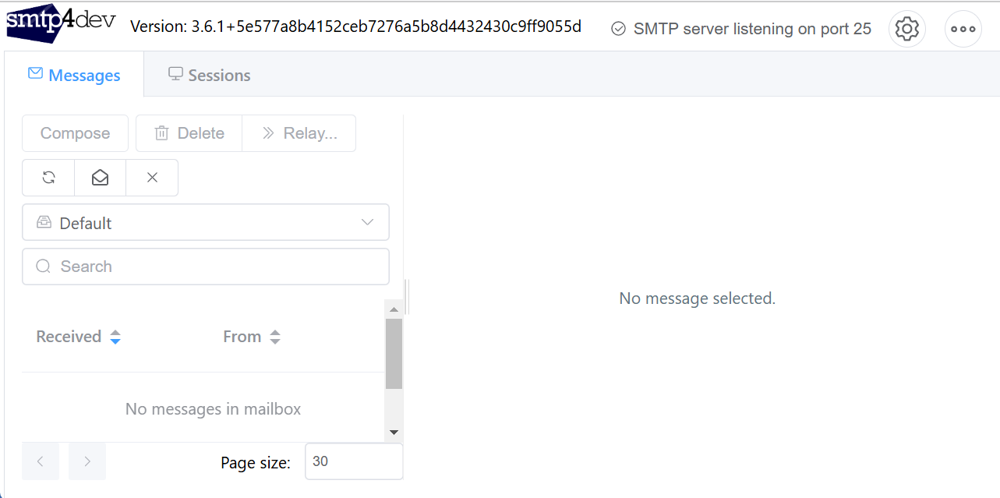

### Tutorial: Instalación y Configuración de un Servidor SMTP Local con **smtp4dev**

En este tutorial, aprenderás a instalar y configurar un servidor SMTP local utilizando **smtp4dev**, una herramienta que simula un servidor SMTP para entornos de desarrollo. Esto es útil para probar el envío de correos electrónicos sin necesidad de conectarte a un servidor SMTP real.

---

#### Requisitos Previos

1. **.NET SDK instalado**: Asegúrate de tener instalado el SDK de .NET. Puedes verificarlo ejecutando:
   ```bash
   dotnet --version
   ```
2. **Conocimientos básicos de SMTP**: Familiarízate con los conceptos básicos de SMTP (Simple Mail Transfer Protocol).

---

### Paso 1: Instalar smtp4dev como Herramienta Global

**smtp4dev** es una herramienta que se instala como una herramienta global de .NET. Para instalarla, ejecuta el siguiente comando:

```bash
dotnet tool install -g Rnwood.Smtp4dev
```

#### Explicación:
- **`dotnet tool install`**: Comando para instalar una herramienta global de .NET.
- **`-g`**: Indica que la herramienta se instalará globalmente.
- **`Rnwood.Smtp4dev`**: Nombre del paquete de smtp4dev.

---

### Paso 2: Iniciar smtp4dev

Una vez instalado, puedes iniciar **smtp4dev** ejecutando el siguiente comando:

```bash
smtp4dev
```

#### Explicación:
- **`smtp4dev`**: Comando para iniciar la herramienta.

#### ¿Qué sucede aquí?
1. **smtp4dev** se ejecuta y abre una interfaz gráfica en tu navegador.
2. El servidor SMTP local se inicia en el puerto **25** (para SMTP) y **587** (para SMTP con autenticación).
3. También se habilita una interfaz HTTP en el puerto **5000** para ver los correos recibidos.

---

### Paso 3: Configurar smtp4dev

Al iniciar **smtp4dev**, se abre automáticamente una interfaz web en tu navegador. Si no se abre, puedes acceder manualmente a:

```
http://localhost:5000
```

#### Interfaz de smtp4dev:
- **Mensajes recibidos**: Aquí se muestran todos los correos electrónicos que se envían a través del servidor SMTP local.
- **Configuración**: Puedes ajustar la configuración del servidor SMTP, como los puertos y la autenticación.

---

### Paso 4: Configurar tu Aplicación para Usar smtp4dev

Para probar el envío de correos electrónicos, configura tu aplicación para usar el servidor SMTP local. Aquí tienes un ejemplo en .NET:

1. **Agrega el paquete `System.Net.Mail`** (si no lo tienes):
   ```bash
   dotnet add package System.Net.Mail
   ```

2. **Configura el cliente SMTP en tu aplicación**:
   ```csharp
   using System;
   using System.Net;
   using System.Net.Mail;

   class Program
   {
       static void Main(string[] args)
       {
           try
           {
               // Configurar el cliente SMTP
               var smtpClient = new SmtpClient("localhost")
               {
                   Port = 25, // Puerto SMTP de smtp4dev
                   EnableSsl = false, // No se requiere SSL para smtp4dev
                   UseDefaultCredentials = true, // No se requiere autenticación
               };

               // Crear el mensaje de correo
               var mailMessage = new MailMessage
               {
                   From = new MailAddress("from@example.com"),
                   Subject = "Prueba de correo",
                   Body = "<h1>¡Hola, esto es una prueba!</h1>",
                   IsBodyHtml = true,
               };
               mailMessage.To.Add("to@example.com");

               // Enviar el correo
               smtpClient.Send(mailMessage);

               Console.WriteLine("Correo enviado correctamente.");
           }
           catch (Exception ex)
           {
               Console.WriteLine($"Error al enviar el correo: {ex.Message}");
           }
       }
   }
   ```

3. **Ejecuta tu aplicación**:
   ```bash
   dotnet run
   ```

---

### Paso 5: Verificar los Correos Recibidos

Después de ejecutar tu aplicación, los correos enviados se mostrarán en la interfaz de **smtp4dev**:

1. Abre tu navegador y ve a `http://localhost:5000`.
2. En la sección **Mensajes recibidos**, verás el correo que acabas de enviar.
3. Puedes hacer clic en el correo para ver su contenido, encabezados y detalles.



---

### Paso 6: Detener smtp4dev

Para detener **smtp4dev**, simplemente cierra la ventana de la terminal donde se está ejecutando o presiona `Ctrl + C`.

---

### Paso 7: Desinstalar smtp4dev (Opcional)

Si ya no necesitas **smtp4dev**, puedes desinstalarla ejecutando:

```bash
dotnet tool uninstall -g Rnwood.Smtp4dev
```

#### Explicación:
- **`dotnet tool uninstall`**: Comando para desinstalar una herramienta global de .NET.
- **`-g`**: Indica que la herramienta se desinstalará globalmente.
- **`Rnwood.Smtp4dev`**: Nombre del paquete de smtp4dev.


